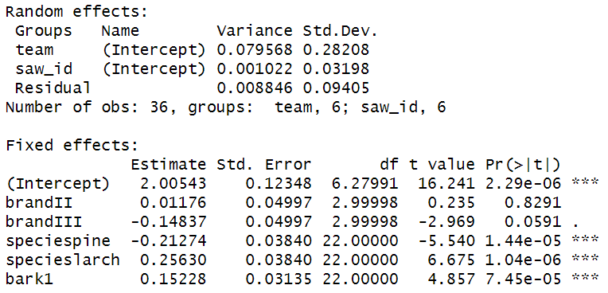
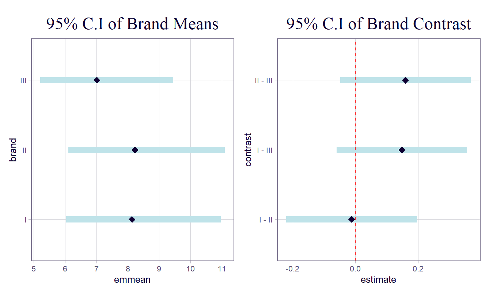
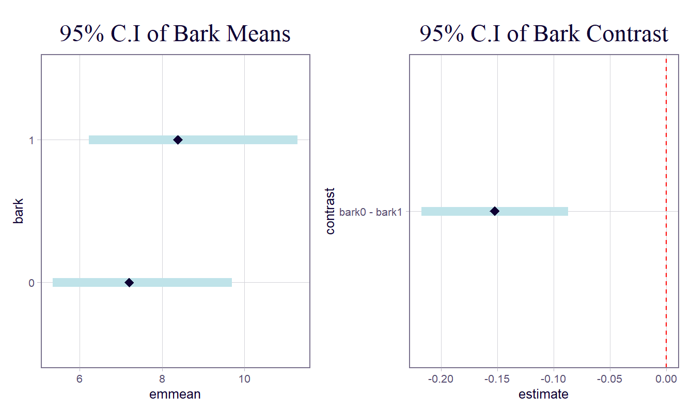
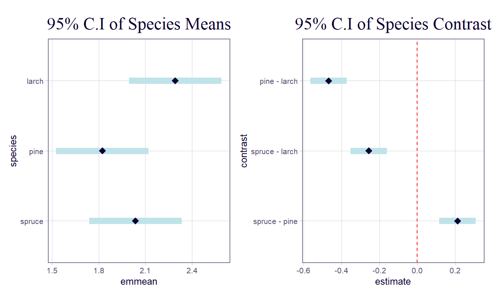

```{r}
#| label: load data 1
#| include: false


source("R/exercise_1.R")

```

# Exercise 1

## Visualisation

Exploring the data, @fig-boxplot-bulls shows the percentage of conception by bull, displayed in a box plot. @fig-boxplot-bulls shows a large variance in the samples from bull 4, while others, e.g., bull 3 have a lower variance. Furthermore, bull 5 has a high percentage of conception compared to the rest of the sample.

```{r}
#| label: fig-boxplot-bulls
#| echo: false
#| fig-cap: Percentage of conception of bulls.
#| fig-asp: .8
#| fig-pos: h

par(mai=c(1, 1, .25, 0.5))
boxplot(perc ~ bull, data = df, xlab = 'Bull', ylab = '% of Conceptions', las=1, col=2:7)
par(mai=c(1, 1, 1, 1))

```

## Estimation of percentage of conception

Considering the bulls as a random sample of a population, and assuming that observations from each bull are correlated, the percentage of conception can be estimated with a random-effects model with bull as a random factor.

### Model

$$
y_{ij} = \mu + a_{i} + \epsilon_{ij}
$$ {#eq-model1}

Where:

- $y_{ij}$ represents the $j$-th percentage measurement for the $i$-th bull.

- $\mu$ is the overall true average percentage of conceptions across the entire population.

- $a_{i}$ is the random effect for the $i$-th bull, assumed to be normally distributed with a mean of zero and a variance of $\sigma_{a}^{2}$ ($a_{i} \sim N\left( 0,\sigma_{a}^{2} \right)$).

- $\epsilon_{ij}$ is the residual measurement error for each specific sample, assumed to be normally distributed with a mean of zero and a variance of $\sigma_{\epsilon}^{2}$ ($\epsilon_{ij} \sim N\left( 0,\sigma_{\epsilon}^{2} \right)$).

 

## Results

$\mu=$ **`r estimate`**

Bull-to-bull variability (${\widehat{\sigma}}_{a}^{2}$): `r round(sigma_bull, 2)`

Within-bull/Residual variability (${\widehat{\sigma}}_{\epsilon}^{2}$): `r round(sigma_within, 2)`

To calculate the heritability parameter, $h$, @eq-heritability is used.

$$
h = \frac{4\sigma_{a}^{2}}{\sigma_{a}^{2} + \sigma_{\epsilon}^{2}}
$$ {#eq-heritability}

$h$ = `r round(heritability * 100, 2)`%

::: {}
:::

# Exercise 2

```{r}
#| label: load data 2
#| include: false


source("R/exercise_2.R")

```

## Visualisation

@fig-rat-plots shows boxplots of breaking strength by site (@fig-site), and by treatment (@fig-treat). @fig-treat could indicate that the treatment does not increase breaking strength, or even decreases it.

::: {#fig-rat-plots layout="[[48,-4,48]]" fig-pos="H"}
```{r}
#| label: fig-site
#| echo: false
#| fig-asp: 1.2
#| fig-cap: Strength by Site

# Set up a 1x2 grid for side-by-side boxplots
# par(mfrow = c(1, 2))

# Boxplot: Raw log(Strength) across the 5 Sites
boxplot(logY ~ site, data = rats_data,
        xlab = 'Site on Back', ylab = 'log(Breaking Strength)',
        col = rainbow(5))
points(1:5, means_site, pch = 23, bg = "black") # Add diamond markers for the means
```

```{r}
#| label: fig-treat
#| echo: false
#| fig-asp: 1.2
#| fig-cap: Strength by Treatment
# Boxplot: Raw log(Strength) across the 2 Treatments
boxplot(logY ~ treat, data = rats_data,
        xlab = 'Treatment', ylab = 'log(Breaking Strength)',
        col = c("lightblue", "lightgreen"))
points(1:2, means_treat, pch = 23, bg = "black")

# Reset the plot grid to 1x1
# par(mfrow = c(1, 1))

```

Visualisations of rat data
:::

## Task i)

An initial linear mixed model, @eq-model2a-lmm, is fitted with interactions between Treatment and Site.

$$
\log Y_{ijk} = \mu + \alpha_{i} + \beta_{j} + (\alpha\beta)_{ij} + d_{k} + \epsilon_{ijk}
$$ {#eq-model2a-lmm}

Where:

- $\log Y_{ijk}$ is the log-transformed breaking energy for the $k$-th rat at the $i$-th site under the $j$-th treatment.

- $\mu$ is the overall average $logY$.

- $\alpha_{i}$ is the fixed main effect of the $i$-th site (1 through 5).

- $\beta_{j}$ is the fixed main effect of the $j$-th treatment (Hyperbaric O2 or Control).

- $(\alpha\beta)_{ij}$ is the fixed interaction effect between the $i$-th site and the $j$-th treatment, representing how the treatment effect might change depending on the specific site.

- $d_{k}$ is the random effect of the $k$-th rat, assumed to be normally distributed with a mean of zero and a variance of $\sigma_{rat}^{2}$ ($d_{k} \sim N\left( 0,\sigma_{rat}^{2} \right)$).

- $\epsilon_{ijk}$ is the residual measurement error, assumed to be normally distributed with a mean of zero and a variance of $\sigma^{2}$ ($\epsilon_{ijk} \sim N\left( 0,\sigma^{2} \right)$).

Running an F-test (`drop1`) shows a p-value value of 0.4292 for the interaction $(\alpha\beta)_{ij}$, i.e., the interaction is insignificant indicating it can be dropped.

A final linear mixed model, @eq-model2b-lmm, is fitted, omitting the interaction between Treatment and Site and keeping rat as a random effect.

$$
\log Y_{ijk} = \mu + \alpha_{i} + \beta_{j} + d_{k} + \epsilon_{ijk}
$$ {#eq-model2b-lmm}

Analysis of variance (ANOVA) of the final model showed that *site* was statistically significant with $p =$ `r round(lmm2_anova[1,6], 4)` and is likely to effect the logarithm of the response $Y$, unlike *treatment* with $p =$ `r round(lmm2_anova[2,6], 4)`, see @tbl-rat-anova.

```{r}
#| tbl-cap: Analysis of variance (ANOVA) of @eq-model2b-lmm.
#| label: tbl-rat-anova

library(knitr)

lmm2_anova %>% 
  rename('p-value' = `Pr(>F)`) %>% 
  kable()

```

The variance from rat to rat is `r round(vars[1, "vcov"], 4)` and the variance of the residual measurement is `r round(vars[2, "vcov"], 4)`. The effect of each site can be seen in @tbl-rat-coef, relative to the intercept which is site 1. Sites 2,3,4 increase the logarithm of the response where site 5 decreases the logarithm of the response. The treatment which is deemed insignificant also decreases the logarithmic response.

```{r}
#| tbl-cap: Fixed effects coefficients of @eq-model2b-lmm.
#| label: tbl-rat-coef

m2_coef %>% 
  rename('p-value' = last_col()) %>% 
  kable()

```

## Task ii)

Site 5 exhibited the lowest estimated marginal mean, as seen in @fig-emm.

```{r}
#| label: fig-emm
#| fig-cap: Estimated Marginal Mean of logY
#| fig-pos: h

plot(site_means, comparisons = TRUE,
     xlab = "EMM",
     ylab = "Site on Back") +
  theme(plot.title = element_text(hjust = 0.5))

```

```{r}
#| label: fig-tukey
#| fig-cap: "95% family-wise confidence level: Site Differences"
#| fig-pos: H
#| fig-asp: .6

par(mai=c(1, 1, .25, 0.5))
plot(mult_site, col=2:11,
     main = "")
par(mai=c(1, 1, 1, 1))

```

As can be seen in @fig-tukey, the pairwise comparisons involving site 5 showed that the 95% confidence intervals for the comparisons between site 5 and sites 2, 3, and 4 did not include zero, indicating significant differences. In contrast, the confidence interval for the comparison between sites 5 and 1 included zero, indicating no statistically significant difference between these two sites.

## Task iii)

Fitting a linear model (@eq-rat-lm) suggest the *treatment* is significant due to the linear model underestimating the "true" variance which the LMM takes into account as can be seen in @tbl-lmfit-coef.

$$
\log(Y) = \mu + \text{site} + \text{treat} + \varepsilon
$$ {#eq-rat-lm}

None of the p-values indicate any statistical significance in @tbl-lmfit-coef.

```{r}
#| label: tbl-lmfit-coef
#| tbl-cap: "Coefficients of a fitted linear model."

lmcoef <- lm_fit_sum$coefficients %>% 
  as.data.frame()

lmcoef <- lmcoef[1:5,]

lmcoef %>% 
  rename("p-value" = last_col()) %>% 
  kable()

```


F-test of the linear model, @eq-rat-lm, shows that reducing the model by removing *site* is possible ($p$ = `r signif(var_p[2,1], 3)`) and that *treatment* is significant ($p$ = `r signif(var_p[3,1], 3)`).

Conversely, as shown previously in the analysis of variance of the LMM model, @tbl-rat-anova, *site* is a statistically significant variable ($p$ = `r signif(lmm2_anova[1,6], 3)`) and *treatment* is not significant ($p$ = `r signif(lmm2_anova[2,6], 3)`), thus showing the opposite result of @eq-rat-lm.

# Exercise 3

```{r}
#| label: load data 3
#| include: false

source("R/exercise_3.R")

```

```{r}
#| label: fig-explore-saw
#| fig-pos: H
#| fig-cap: Exploratory plots of the "Saw" data.
#| fig-asp: .8

# Exploratory Plots
par(mfrow = c(1, 3),
    mai=c(.7, .6, .25, 0.2))
boxplot(ly ~ brand, data = saw_data, col = "lightblue", main = "log(Time) by Brand")
boxplot(ly ~ bark, data = saw_data, col = "lightgreen", main = "log(Time) by Bark")
boxplot(ly ~ species, data = saw_data, col = "lightpink", main = "log(Time) by Species")
par(mfrow = c(1, 1))


```

Model:

$$
\log\left( y_{ijklm} \right) = \mu + \alpha_{i} + \beta_{j} + (\alpha\beta)_{ij} + \gamma_{k} + t_{l} + s_{m} + \epsilon_{ijklm}
$$ {#eq-saw-lmm}

Where:

- $\log\left( y_{ijklm} \right)$ is the log-transformed cutting time for the $i$-th brand, $j$-th bark status, $k$-th species, used by the $l$-th team, with the $m$-th specific physical saw.

- $\mu$ is the overall average log-transformed cutting time.

- $\alpha_{i}$ is the fixed main effect of the $i$-th saw brand.

- $\beta_{j}$ is the fixed main effect of the $j$-th bark status (e.g., bark vs. no bark).

- $(\alpha\beta)_{ij}$ is the fixed interaction effect between the $i$-th saw brand and the $j$-th bark status, representing whether the time saved by debarking depends on which brand of saw is used.

- $\gamma_{k}$ is the fixed main effect of the $k$-th wood species (e.g., spruce, pine).

- $t_{l}$ is the random effect of the $l$-th team, assumed to be normally distributed with a mean of zero and a variance of $\sigma_{team}^{2}$ ($t_{l} \sim N\left( 0,\sigma_{team}^{2} \right)$).

- $s_{m}$ is the random effect of the $m$-th physical saw, assumed to be normally distributed with a mean of zero and a variance of $\sigma_{saw}^{2}$ ($s_{m} \sim N\left( 0,\sigma_{saw}^{2} \right)$).

- $\epsilon_{ijklm}$ is the residual measurement error, assumed to be normally distributed with a mean of zero and a variance of $\sigma^{2}$ ($\epsilon_{ijklm} \sim N\left( 0,\sigma^{2} \right)$).

Fitting this model shows the interaction is not necessary ($p$ = `r signif(drop1_m1[2,6], 3)`)  on the interaction when performing a F-test. Thus, the model is reduced to a final model, @eq-saw-final-lmm:

$$
\log\left( y_{ijklm} \right) = \mu + \alpha_{i} + \beta_{j} + \gamma_{k} + t_{l} + s_{m} + \epsilon_{ijklm}
$$ {#eq-saw-final-lmm}

{width="4.386502624671916in" height="2.113063210848644in"}

## Findings from the additive model

```{r}


```

Fixed Effects : Brand appears to not be significantly significant with the others being significant.

Random Effects : Saw_id has very small variance indicating it has very little effect on the final results. E.g using saw A or D makes very small differences.

Part i) {width="6.268055555555556in" height="3.7569444444444446in"}

As can be seen all brnads perform fairly similar and there can be no statistcall results in the difference of cutting time due to brand type. Confidence interval of all contrast contains 0.

Part ii)

{width="6.268055555555556in" height="3.7569444444444446in"}

It can be seen that bark is significantly significant reducing the cutting time by about 0.15 minutes with fairly high confidence not containg 0. Insert p-value

Part iii){width="6.268055555555556in" height="3.7569444444444446in"}

All species are statistically significant. Insert p-values
