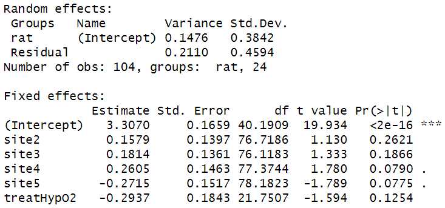
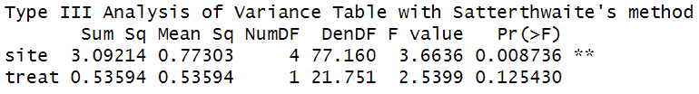
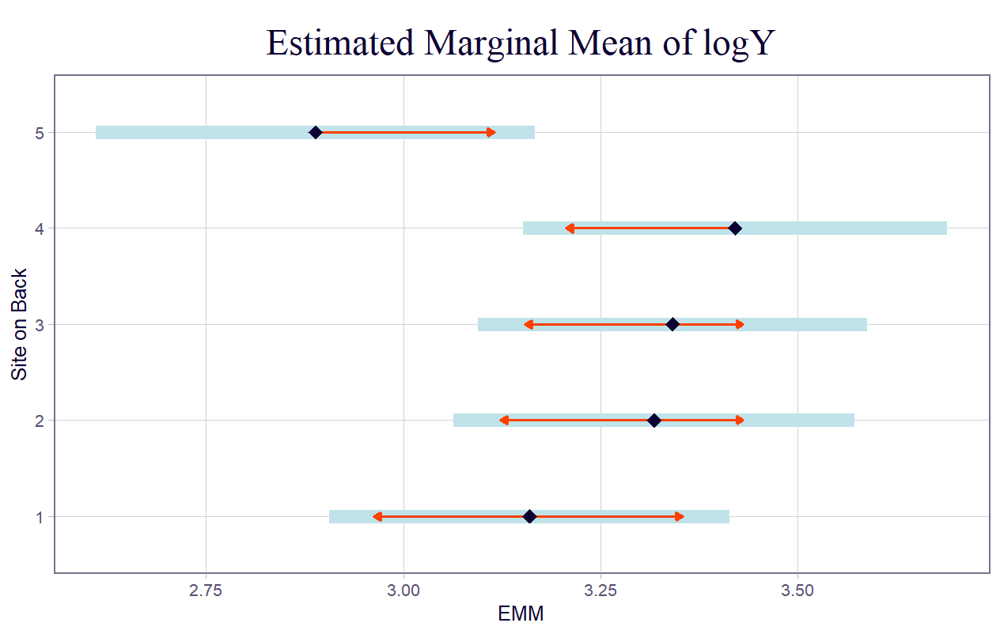
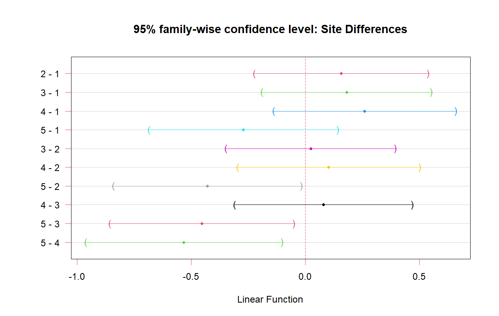
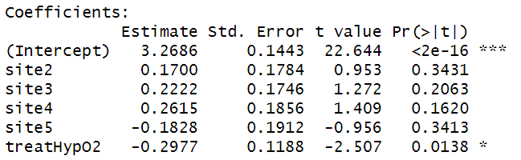
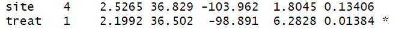
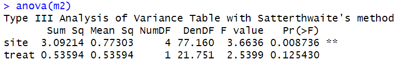
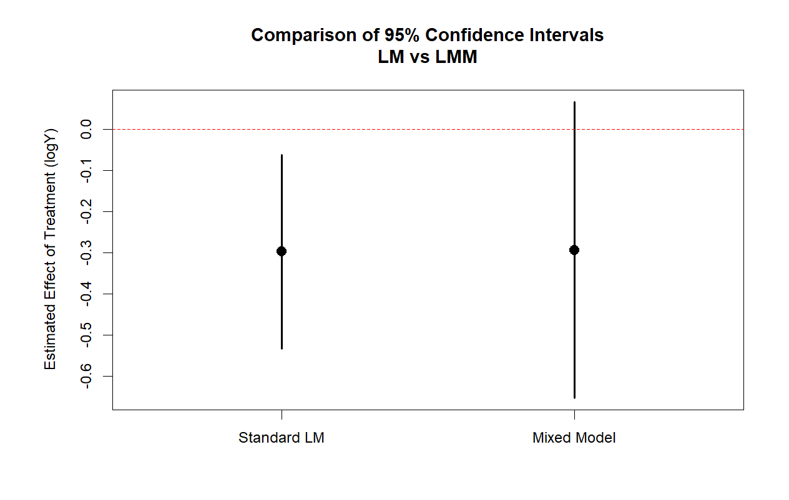
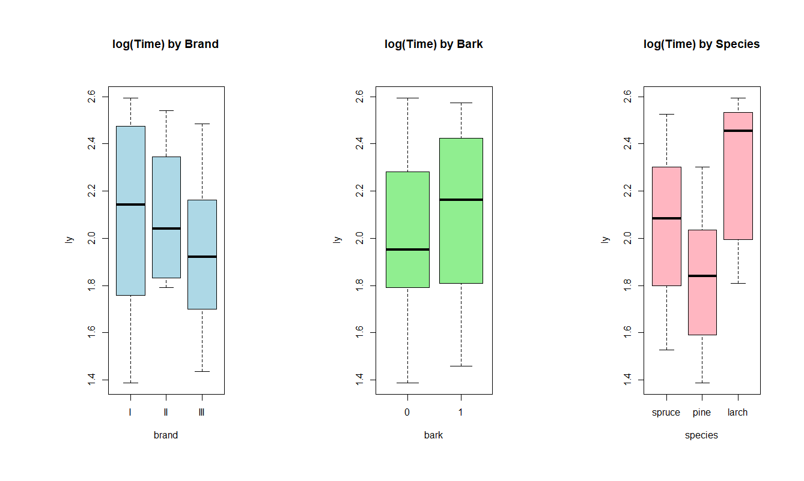

```{r}
#| label: load data
#| include: false


source("R/exercise_1.R")

```

# Exercise 1


## Visualisation


```{r}

boxplot(perc ~ bull, data = df, xlab = 'Bull', ylab = '% of Conceptions', las=1, col=2:7, main = "Box Plot of Bull Conceptions Rates")

```

## Model

$$
y_{ij} = \mu + a_{i} + \epsilon_{ij}
$$

Where:

- $y_{ij}$ represents the $j$-th percentage measurement for the $i$-th bull.

- $\mu$ is the overall true average percentage of conceptions across the entire population.

- $a_{i}$ is the random effect for the $i$-th bull, assumed to be normally distributed with a mean of zero and a variance of $\sigma_{a}^{2}$ ($a_{i} \sim N\left( 0,\sigma_{a}^{2} \right)$).

- $\epsilon_{ij}$ is the residual measurement error for each specific sample, assumed to be normally distributed with a mean of zero and a variance of $\sigma_{\epsilon}^{2}$ ($\epsilon_{ij} \sim N\left( 0,\sigma_{\epsilon}^{2} \right)$).

## Results

Intercept ($\mu)$ = 53.318

Bull-to-bull variability (${\widehat{\sigma}}_{a}^{2}$): 76.8

Within-bull/Residual variability (${\widehat{\sigma}}_{\epsilon}^{2}$): 248.7

$h = \frac{4\sigma_{a}^{2}}{\sigma_{a}^{2} + \sigma_{\epsilon}^{2}}$.

h = 94.39%

95% Confidence interval of standard deviation of Random Effects

Between Bull-to-bull: (0.000, 19.35)%

Within Bull-to-bull: (12.45, 20.94)%

Overall Average rate of Conception: (43.68, 63.05)%

Summary :

# Exercise 2


## Model

Initial Model : With Interactions

$$\log Y_{ijk} = \mu + \alpha_{i} + \beta_{j} + (\alpha\beta)_{ij} + d_{k} + \epsilon_{ijk}$$

Where:

- $\log Y_{ijk}$ is the log-transformed breaking energy for the $k$-th rat at the $i$-th site under the $j$-th treatment.

- $\mu$ is the overall average $logY$.

- $\alpha_{i}$ is the fixed main effect of the $i$-th site (1 through 5).

- $\beta_{j}$ is the fixed main effect of the $j$-th treatment (Hyperbaric O2 or Control).

- $(\alpha\beta)_{ij}$ is the fixed interaction effect between the $i$-th site and the $j$-th treatment, representing how the treatment effect might change depending on the specific site.

- $d_{k}$ is the random effect of the $k$-th rat, assumed to be normally distributed with a mean of zero and a variance of $\sigma_{rat}^{2}$ ($d_{k} \sim N\left( 0,\sigma_{rat}^{2} \right)$).

- $\epsilon_{ijk}$ is the residual measurement error, assumed to be normally distributed with a mean of zero and a variance of $\sigma^{2}$ ($\epsilon_{ijk} \sim N\left( 0,\sigma^{2} \right)$).

Running drop1 shows a p-value value of 0.4292 for the interaction $(\alpha\beta)_{ij}$ so the interaction is insignificant indicating it can be dropped.

## Final Model

$$\log Y_{ijk} = \mu + \alpha_{i} + \beta_{j} + d_{k} + \epsilon_{ijk}$$

{width="3.238993875765529in" height="1.5157895888014in"}

{width="3.1157895888014in" height="0.4208005249343832in"}

**Part i)** As can be seen site has a statistically significant p-value of 0.0087 and is likely to effect the logarithm of the response Y unlike treatment type which has a p-value of 0.1254 which is \>0.05. The variance from rat to rat is 0.1476 and the variance of the residual measurement is 0.2110. The effect of each site can be seen above relative to the intercept which is site 1. Sites 2,3,4 increase the logarithm of the response where site 5 decreases the logarithm of the response. The treatment which is deemed insignificant also decreases the logarithmic the response.

**Part ii)**

95% Confidence Interval

{width="4.7944892825896765in" height="3.0421052055993in"}

{width="5.2157895888014in" height="3.309420384951881in"}

As can be seen in interactions with site 5, all interactions Confidence intervals don't contain 0, except 5-1 which does contain 0. So there may be no statistical difference between site 5 and 1. But site 5 is different from 2,3 and 4.

**Part iii)**

Fitting a linear model suggest the treatment is significantly significant due to the linear model underestimating the "true" variance which the LMM takes into account as can be seen below. State p-values

{width="2.0421052055993in" height="0.6294192913385827in"}

Drop1 of linear model:

{width="2.7604385389326334in" height="0.22631561679790027in"}

Drop1 of LMM:

{width="3.4894739720034997in" height="0.5385367454068242in"}

Comparison:

The linear model predicts the treatment is significant with p-value 0.0138 and that site is not with p-value 0.1341. But the LMM predicts the "opposite". The linear model fits the data

{width="4.0479429133858265in" height="2.5684208223972003in"}

# Exercise 3

Visualisation of Data: {width="6.268055555555556in" height="3.7569444444444446in"}

Model:

$$\log\left( y_{ijklm} \right) = \mu + \alpha_{i} + \beta_{j} + (\alpha\beta)_{ij} + \gamma_{k} + t_{l} + s_{m} + \epsilon_{ijklm}$$

Where:

- $\log\left( y_{ijklm} \right)$ is the log-transformed cutting time for the $i$-th brand, $j$-th bark status, $k$-th species, used by the $l$-th team, with the $m$-th specific physical saw.

- $\mu$ is the overall average log-transformed cutting time.

- $\alpha_{i}$ is the fixed main effect of the $i$-th saw brand.

- $\beta_{j}$ is the fixed main effect of the $j$-th bark status (e.g., bark vs. no bark).

- $(\alpha\beta)_{ij}$ is the fixed interaction effect between the $i$-th saw brand and the $j$-th bark status, representing whether the time saved by debarking depends on which brand of saw is used.

- $\gamma_{k}$ is the fixed main effect of the $k$-th wood species (e.g., spruce, pine).

- $t_{l}$ is the random effect of the $l$-th team, assumed to be normally distributed with a mean of zero and a variance of $\sigma_{team}^{2}$ ($t_{l} \sim N\left( 0,\sigma_{team}^{2} \right)$).

- $s_{m}$ is the random effect of the $m$-th physical saw, assumed to be normally distributed with a mean of zero and a variance of $\sigma_{saw}^{2}$ ($s_{m} \sim N\left( 0,\sigma_{saw}^{2} \right)$).

- $\epsilon_{ijklm}$ is the residual measurement error, assumed to be normally distributed with a mean of zero and a variance of $\sigma^{2}$ ($\epsilon_{ijklm} \sim N\left( 0,\sigma^{2} \right)$).

Fitting this model shows the interaction is not necessary with a p-value of 0.8730176 on the interaction when performing a F-test

Final Model:

$$\log\left( y_{ijklm} \right) = \mu + \alpha_{i} + \beta_{j} + \gamma_{k} + t_{l} + s_{m} + \epsilon_{ijklm}$$

{width="4.386502624671916in" height="2.113063210848644in"}

Findings:

Fixed Effects : Brand appears to not be significantly significant with the others being significant.

Random Effects : Saw_id has very small variance indicating it has very little effect on the final results. E.g using saw A or D makes very small differences.

Part i) {width="6.268055555555556in" height="3.7569444444444446in"}

As can be seen all brnads perform fairly similar and there can be no statistcall results in the difference of cutting time due to brand type. Confidence interval of all contrast contains 0.

Part ii)

{width="6.268055555555556in" height="3.7569444444444446in"}

It can be seen that bark is significantly significant reducing the cutting time by about 0.15 minutes with fairly high confidence not containg 0. Insert p-value

Part iii){width="6.268055555555556in" height="3.7569444444444446in"}

All species are statistically significant. Insert p-values
